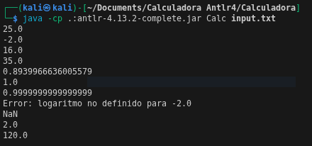
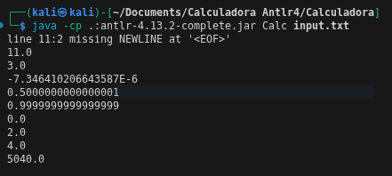

# Ejecucion de Calculadora

## Compilamos la gramatica g4 
```bash
antlr4 -visitor LabeledExpr.g4
```
La flag -visitor, permite que antlr, ademas de compilar el parser y el scanner, permite la creacion de las interfaces para utilizar con EvalVisitor
## Compilamos los archivos .java
```bash
javac -cp .:antlr-4.13.2-complete.jar *.java
```
## Ejecutamos el main class y agregamos el input

```bash
java -cp .:antlr-4.13.2-complete.jar Calc input.txt
```
---
# Caso de uso
Si ingresamos los siguientes statements para verificar que EvalVisitor este funcionando:
```txt
a = 10
b = a * 2 + 5
b
10 + 2 * 3
a + 5 * (2 + 3)
```
## Compilamos y ejecutamos, obtenemos lo siguiente


Si nos damos cuenta, esta asignando 10 a la variable a, luego la multiplica por 2 y le suma 5, en la siguiente linea decide imprimirla y es 25. Luego imprime el resultado de 10 + 2 * 3, que es 16 y por ultimo imprime 35.
## Otro input
```txt
a = 10
a / 3
b = a * 2 + 5
b^2
10 + 2 * 3
a + 5 * (2 + 3) 
```
Resultado:


---
# ¿Por que Funciona?
La generacion de gramatica solo permite definir la estructura de las reglas gramaticales, la implementacion de un main y de EvalVisitor, sirve para recorrer el arbol de reglas gramaticales y evaluar la expresion de cada nodo, como su nombre lo dice "EvalVisitor" se encarga de recorrer el arbol y evaluar los parametros. 

La implementacion de EvalVisitor sobre-escribe cada regla gramatical dependiendo del nodo en donde este parado, es por eso que para cada regla gramatical usamos el # "caracterizador", el caracterizador permite a EvalVisitor realizar un proceso respectivo para cada caracterizador, esto permite que EvalVIsitor distinga entre imprimir una cadena, hacer operaciones o una asignacion.

Funcion para imprimir una variable o caracter en el arbol:


Funcion para reconocer un entero:


# Uso de Operaciones trigonometricas y funciones no lineales

Ampliamos nuestras reglas gramaticales para:
* Calculo de sen, tan, cos. Tanto para radianes (rad) y grados 
* Calculo de logaritmo natural (ln) y logaritmo base 10 (log)
* Calculo de factorial (!)
* Numeros decimales y negativos
---
Para definir si la funcion trigonometrica este en radianes o en grados, debemos utilizar lo siguiente:
* rad funcion() # Para calcular la funcion trigonometrica en radianes
* funcion() # Para calcular la funcion trigonometrica en grados
```bash
grammar LabeledExpr;
prog: stat+ ;

stat: expr NEWLINE             # printExpr
    | ID '=' expr NEWLINE      # assign
    | NEWLINE                  # blank
    ;

expr: '-' expr                      # numN
    | expr op=('*'|'/'|'%'|'^') expr # MulDiv
    | expr op=('+'|'-') expr        # AddSub
    | INT                           # int 
    | ID                            # id 
    | DOUBLE                        # double
    | '(' expr ')'                  # parens 
    | RAD func=ID '(' expr ')'       # funcRad
    | func=ID '(' expr ')'          # funcCall
    | SQRT '(' expr ')'             # sqrtf   
    | LN '(' expr ')'               # lnf
    | LOG '(' expr ')'              # logf  
    | expr FACT                     # factf
    ;

MUL : '*' ;
DIV : '/' ;
MOD : '%' ;
POW : '^' ;
ADD : '+' ;
SUB : '-' ;
DOUBLE : [0-9]+ '.' [0-9]+ ;
INT : [0-9]+ ;
RAD : 'rad' ;
SQRT : 'sqrt' ;
LN : 'ln' ;
LOG : 'log' ;
FACT : '!' ;
ID  : [a-zA-Z]+ ;
NEWLINE:'\r'? '\n' ;
WS  : [ \t]+ -> skip ;
```
Para el Eval Visitor poder ejecutar las instrucciones, creamos las funciones para cada funcion y asi las evalue dependiendo del contexto:

```bash
@Override
    public Double visitLnf(LabeledExprParser.LnfContext ctx) {
        double value = visit(ctx.expr());
        if (value <= 0) {
            System.err.println("Error: logaritmo no definido para " + value);
            return Double.NaN;
        }
        return Math.log(value);
    }
    @Override
    public Double visitLogf(LabeledExprParser.LogfContext ctx) {
        double value = visit(ctx.expr());
        if (value <= 0) {
            System.err.println("Error: logaritmo no definido para " + value);return Double.NaN;
            
        }
        return Math.log10(value);
    }
    @Override
    public Double visitSqrtf(LabeledExprParser.SqrtfContext ctx) {
        double value = visit(ctx.expr());
        if (value < 0) {
            System.err.println("Error: raiz cuadrada no definida para " + value);
            return Double.NaN;
        }
        return Math.sqrt(value);
    }
    @Override
    public Double visitFactf(LabeledExprParser.FactfContext ctx) {
        double value = visit(ctx.expr());
        if (value < 0) {
            System.err.println("Error: factorial no definido para " + value);
            return Double.NaN;
        }
        return factorial(value);
    }

    private double factorial(double n) {
        if (n == 0) return 1;
        return n * factorial(n - 1);
    }
```
## Prueba 1

Input:
```bash
1 - 3
10 + 2 * 3
a + 5 * (2 + 3)
rad sin(90)
rad cos(0)
tan(45)
log(-2)
sqrt(4)
5!

```

Output: 



---
## Prueba 2
Input
```bash
a = 5
b = 3
a + b * 2
(10 - 4) / 2
rad sin(3.1416)
cos(60)
tan(45)
ln(1)
log(100)
sqrt(16)
7!
```
Output:

