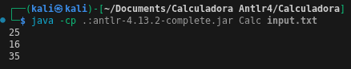
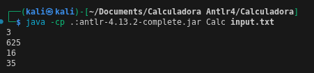
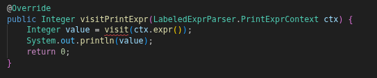
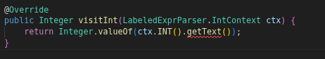

# Ejecucion de Calculadora

## Compilamos la gramatica g4 
```bash
antlr4 -visitor LabeledExpr.g4
```
La flag -visitor, permite que antlr, ademas de compilar el parser y el scanner, permite la creacion de las interfaces para utilizar con EvalVisitor
## Compilamos los archivos .java
```bash
javac -cp .:antlr-4.13.2-complete.jar *.java
```
## Ejecutamos el main class y agregamos el input

```bash
java -cp .:antlr-4.13.2-complete.jar Calc input.txt
```
---
# Caso de uso
Si ingresamos los siguientes statements para verificar que EvalVisitor este funcionando:
```txt
a = 10
b = a * 2 + 5
b
10 + 2 * 3
a + 5 * (2 + 3)
```
## Compilamos y ejecutamos, obtenemos lo siguiente


Si nos damos cuenta, esta asignando 10 a la variable a, luego la multiplica por 2 y le suma 5, en la siguiente linea decide imprimirla y es 25. Luego imprime el resultado de 10 + 2 * 3, que es 16 y por ultimo imprime 35.
## Otro input
```txt
a = 10
a / 3
b = a * 2 + 5
b^2
10 + 2 * 3
a + 5 * (2 + 3) 
```
Resultado:

---
# ¿Por que Funciona?
La generacion de gramatica solo permite definir la estructura de las reglas gramaticales, la implementacion de un main y de EvalVisitor, sirve para recorrer el arbol de reglas gramaticales y evaluar la expresion de cada nodo, como su nombre lo dice "EvalVisitor" se encarga de recorrer el arbol y evaluar los parametros. 

La implementacion de EvalVisitor sobre-escribe cada regla gramatical dependiendo del nodo en donde este parado, es por eso que para cada regla gramatical usamos el # "caracterizador", el caracterizador permite a EvalVisitor realizar un proceso respectivo para cada caracterizador, esto permite que EvalVIsitor distinga entre imprimir una cadena, hacer operaciones o una asignacion.

Funcion para imprimir una variable o caracter en el arbol:

Funcion para reconocer un entero:


# Uso de Operaciones trigonometricas y funciones no lineales
